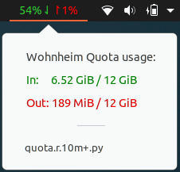

# argos-quota

This is a script to display the internet quota usage of the student dormitories
(Wohnheim) of the Technische Universität Kaiserslautern in the Ubuntu/Gnome
topbar.

## How to use

1. Install the [argos gnome extension](https://github.com/p-e-w/argos)
(if not already installed) and Python 3.

2. Rename (or create a copy and rename) the file `get_quota.py` to the argos
format: `NAME.POSITION.INTERVAL[+].py`
    - `NAME`: script's name
    - `POSITION`: display position
    - `INTERVAL`: update interval, example: `10m` (every 10 minutes)
    - `+`: if should be updated when the popup screen is open

3. Copy the renamed file to the argos folder (usually `~/.config/argos/`).

4. Set the file's permission to allow execution:
`chmod +x ~/.config/argos/<file>`

## Dependencies

This script uses Python 3 and the
[argos gnome extension](https://github.com/p-e-w/argos) to display the content
in the top bar.

## Author

Lucas Hagen
